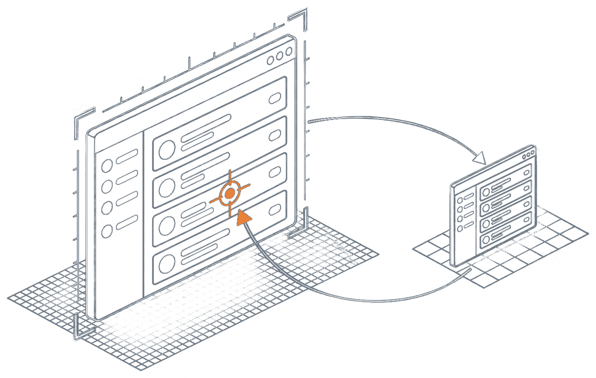
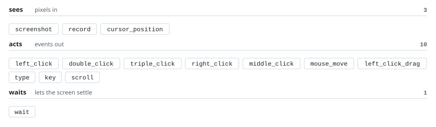

<!-- generated by scripts/readme/build.mjs. do not edit by hand. -->
<p align="center">

</p>

# winuse-mcp

Computer use for Claude Code on Windows. An MCP server that lets Claude see your screen and drive your mouse and keyboard.

Claude Code ships computer use in the CLI on macOS only, so on Windows the `computer-use` server never appears in `/mcp`. This rebuilds the same screenshot-and-click loop on the Windows APIs: 14 tools, 5 dependencies, Python 3.12.

## Install

Needs Windows and [uv](https://docs.astral.sh/uv/). Add this to `.mcp.json` in a project, or to `~/.claude.json` for every project:

```json
{
  "mcpServers": {
    "winuse": {
      "command": "uvx",
      "args": ["--from", "git+https://github.com/ryanportfolio/winuse-mcp", "winuse-mcp"]
    }
  }
}
```

From a local clone instead:

```json
{
  "mcpServers": {
    "winuse": {
      "command": "uv",
      "args": ["run", "--directory", "C:/path/to/winuse-mcp", "winuse-mcp"]
    }
  }
}
```

Restart Claude Code, then ask it to look at your screen or click through an app.

## Reach

<picture>
<source media="(max-width: 500px) and (prefers-color-scheme: dark)" srcset="assets/reach-narrow-dark.svg">
<source media="(max-width: 500px)" srcset="assets/reach-narrow-light.svg">
<source media="(prefers-color-scheme: dark)" srcset="assets/reach-dark.svg">

</picture>

<details>
<summary>Signatures</summary>

| Tool | Does |
|---|---|
| `screenshot()` | PNG of the primary monitor, downscaled |
| `left_click(x, y)` | Click at a point |
| `double_click(x, y)` | Two clicks at a point |
| `triple_click(x, y)` | Three clicks, selects a line or paragraph |
| `right_click(x, y)` | Context-menu click |
| `middle_click(x, y)` | Middle-button click |
| `mouse_move(x, y)` | Move the cursor without clicking |
| `left_click_drag(start_x, start_y, end_x, end_y)` | Press, drag, release |
| `type(text)` | Type at the current focus, non-ASCII goes through the clipboard |
| `key(combo)` | A key or chord: `enter`, `ctrl+s`, `alt+f4` |
| `scroll(x, y, direction, amount)` | `up`, `down`, `left`, `right`; horizontal is sent as shift+wheel |
| `cursor_position()` | Where the mouse is now |
| `record(duration_seconds, max_frames)` | Sample the screen for up to 15s, up to 8 frames |
| `wait(seconds)` | Pause before the next action, up to 10s |

Coordinates are always in screenshot space. See below.

</details>

## How coordinates work

<picture>
<source media="(max-width: 500px) and (prefers-color-scheme: dark)" srcset="assets/transform-narrow-dark.svg">
<source media="(max-width: 500px)" srcset="assets/transform-narrow-light.svg">
<source media="(prefers-color-scheme: dark)" srcset="assets/transform-dark.svg">

</picture>

Screenshots are downscaled so the long edge is at most 1372 pixels, the same target Claude Code uses on macOS. Claude never sees native pixels, so it clicks in the downscaled image and the server converts back.

A 1920x1080 display captures at 1372x772, a factor of 0.715. A click at 686, 443 lands at 960, 620.

The server declares itself DPI-aware at startup, so Windows display scaling at 125% or 150% does not skew where clicks land.

## Safety

This hands a language model control of your desktop. Anthropic's own version wraps the same loop in guardrails this server does not have: per-app approval, hiding apps Claude has not been approved for, keeping your terminal out of the screenshots, and model-side checks on each action.

What you do get:

- Claude Code asks before each tool call unless you allow-list it. Keep the input tools on manual approval and only allow-list `screenshot`.
- Park the mouse in the top-left corner of the screen to abort the action in flight. That is pyautogui's failsafe, and it only watches that one corner. Aborting mid-drag releases the mouse button on the way out, so nothing is left dragging.
- Everything visible reaches the model, including whatever happens to be on screen. Text on screen is untrusted input: treat instructions that appear there as a prompt injection risk.

## Limitations

- Primary monitor only.
- Your terminal is not excluded from screenshots, so Claude sees its own session.
- `record` samples still frames, at most 8 of them. There is no video path.

## Development

```bash
uv sync
uv run winuse-mcp
```

`scripts/client_test.py` is the reference check: it speaks MCP over stdio to the server, lists the tools, takes a screenshot, moves the mouse and reads the position back, records frames, and asserts a bad key combo errors.

```bash
uv run python scripts/client_test.py
```

`scripts/failsafe_test.py` covers the paths a user hits while aborting, with pyautogui stubbed so no real abort is needed: a drag cut short still releases the button, a horizontal scroll cut short still releases shift, chord parsing handles a literal `+`, and no click can land on the failsafe pixel.

```bash
uv run python scripts/failsafe_test.py
```

This README is built. Every number on the page is recomputed from the source at build time, and the build fails if one drifts.

```bash
node scripts/readme/build.mjs
```

## License

MIT
